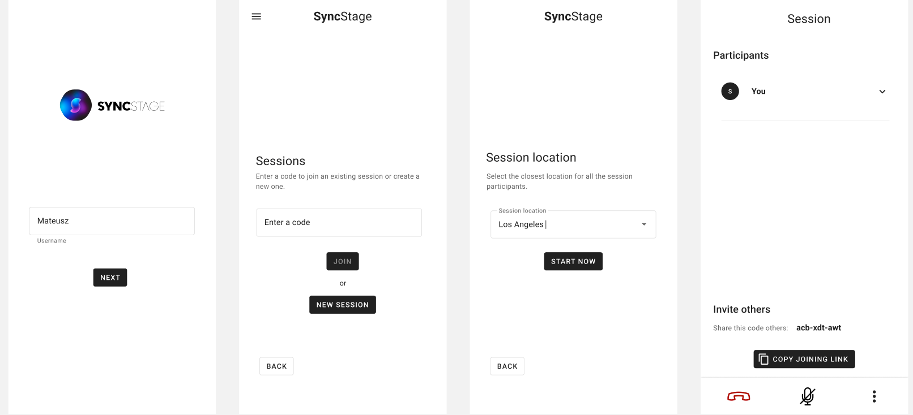
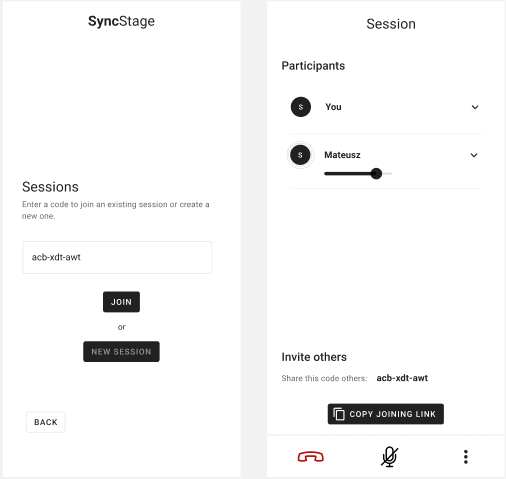
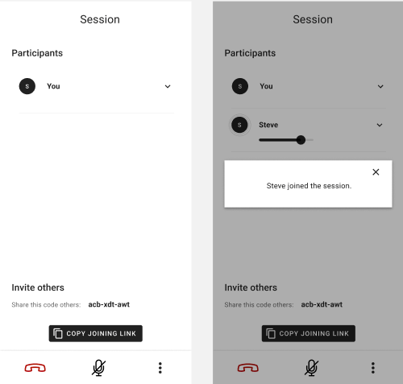

# Test App

The best way to start you joyrney with SyncStage is by trying out our example project available on GitHub [SyncStage Test App for Android](https://github.com/opensesamemedia/syncstage-test-app-android){target=_blank}.
This tutorial shows you how to clone, build, and run the application on your device. The recommended development environment is Android Studio.

## Set up your development project

Follow these steps to create the Test App project in Android Studio.

1. Download and install [Android Studio](https://developer.android.com/studio){target=_blank}.
2. Clone or download the [SyncStage Test App for Android](https://github.com/opensesamemedia/syncstage-test-app-android){target=_blank} repository from GitHub.
3. Import the project:
   1. In Android Studio, select File > New > Import Project.
   2. Go to the location where you saved the SyncStage Test App for Android repository.
   3. Find SyncStage project at this location.
   4. Select the project directory, then click Open. Android Studio now builds your project, using the Gradle build tool.

## Get a SyncStage SDK secret
To run the SyncStage Test App you need to add a SyncStageSecret.json file to your Android Studio project to the assets folder.

**Don't know how to get the secret file?** See our [Quickstart Guide](quickstart.md) for more details.

## Build and run your app
To build and run the app:

1. Connect an Android device to your computer. 
2. Follow the provided guidelines to activate developer options on your Android device and configure your system to detect the connected device.
3. Alternatively, you have the option to utilize the Android Virtual Device (AVD) Manager to set up a virtual device.
4. In Android Studio, click the Run menu option (or :fontawesome-solid-play: button)
5. Select a device.
6. Android Studio invokes Gradle to build the app, and then runs it.

## Use the app

### Create a session  
You first provide an app username (in this example the first user is called ‘Mateusz’), select the New session button and select location of the deployment. To get the best latency experience choose the one that is the nearest to expected geolocation of your users. Once a session is created you will see yourself represented as ‘You’ and be able to share the session code, so that you can invite others. Share the code and wait for others to join you.

### Join a session
The second user - in this example ‘Steve’ - inputs the session code and joins the session (NOTE: you will see on his device, he has the app username of the first user, ‘Mateusz’). Now you are ready to have a synchonous session together!

User Mateusz will be prompted that Steve has joined the session on his device. SyncStage’s audio pipeline supports sessions with up to 8 users. 

### Other functionalities

You can control volume levels of all participants on your end, each app user can mix volumes according to one's needs. Anytime you can mute / unmute yourself or simply leave the session.
