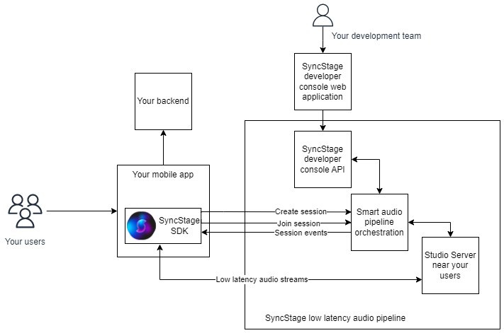

## Architecture

## Glossary

* __SyncStage SDK__ - a library that we provide to you to integrate it into your mobile app.
*  __Your mobile app__ - your custom mobile application that integrates SyncStage SDK.
*  __Your backend__ - your server-side services that your mobile app is communicating with. It is responsible for managing your users.
*  __Your users__ - end users of your mobile app.
*  __Studio Server__ - a low latency audio streaming server.
*  __Session__ - a virtual room where up to 8 users can connect and enjoy a low-latency experience. One mobile app can join only one session at a time.
*  __App user__ - is an end-user of your mobile application, it is managed by your user pool.
*  __Organization__ - stands for your company or other legal entity that will incorporate SyncStage into its products.
*  __Project__ - is an abstraction that encapsulates settings for a particular business case. A Project is related to one organization.
*  __Application__ - is a mobile application that is related to a project. Application is created for a particular platform such as Android / iOS / Unity.
*  __SyncStage Secret__ - is a .plist or .json file containing credentials to provision the SDK. This secret is related to one application. Each application can have one or more secrets, which can be invalidated at any time on developers demand.
*  __Region__ - USA, Asia-Pacific, Europe - regions aggregate zones on a high level, you can assign one or more regions for your projects.
*  __Zone__ - precise location of Studio Server deployment.
*  __Developer Console__ - web application for managing your Organization, Projects, Applications, it provides comprehensive insight into the statistics data and billing.
*  __Developer team__ - developer console users from your organization who have access to your projects and applications.
*  __Audio stream__ - is an audio sent between 2 users of your mobile app.
