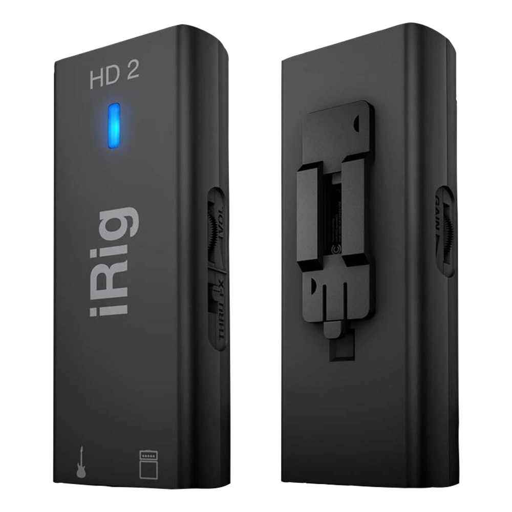
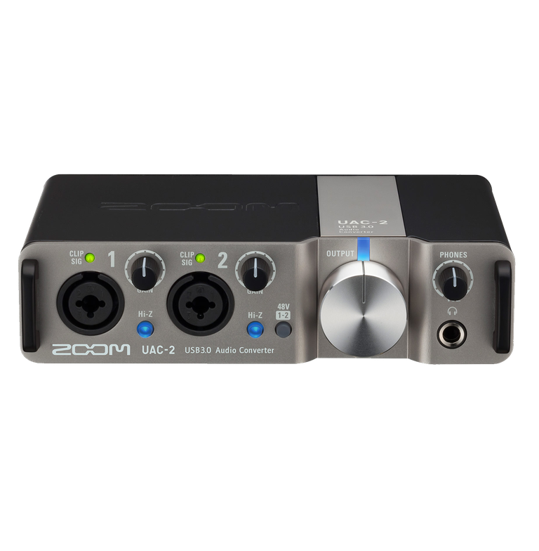
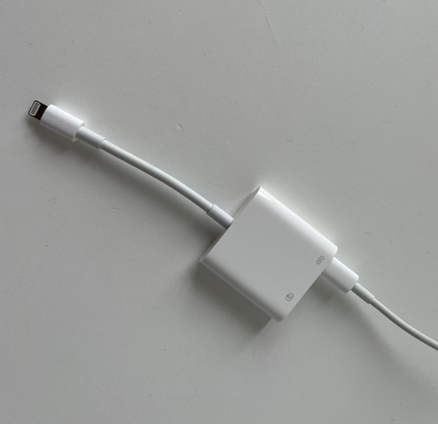
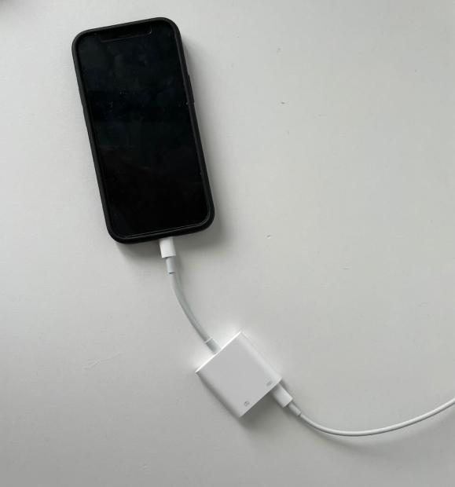
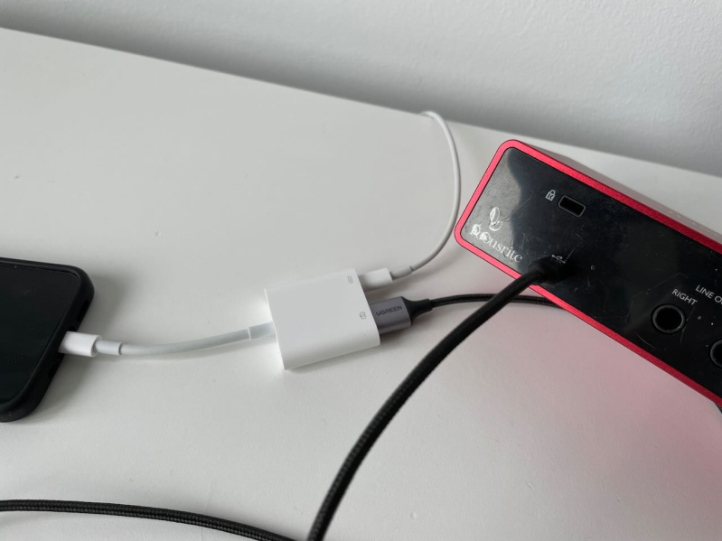
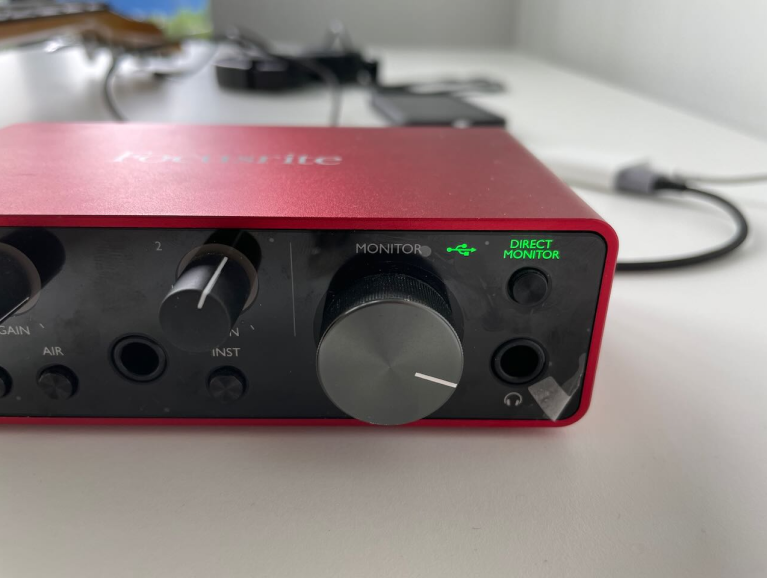
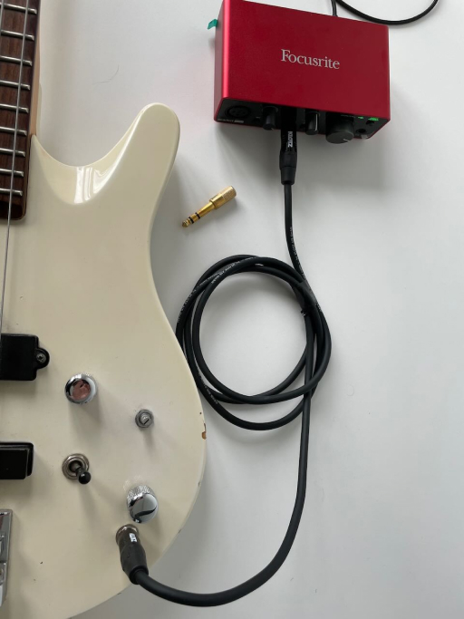
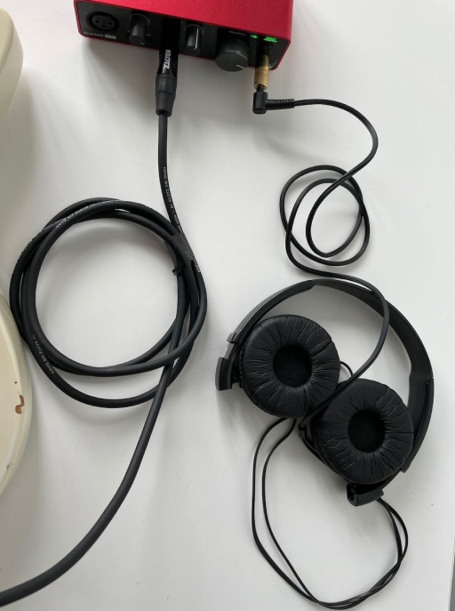

# Audio Interfaces

Good audio interface in a key to achieve pristine sound quality. The good news is that you can connect the audio interface of your choice to SyncStage.

Rule of thumb is that if your smartphone or tablet is compatible with a particular audio interface, SyncStage should also be compatible with it as well.

The steps needed to connect the audio interfaces vary between different types of the devices. 
Here are two main ones:

-   __Audio Interfaces For Mobile Devices__

    ---
    <figure markdown="span">
      { width="300" loading=lazy}
      <figcaption>iRig HD 2 or similar  <small>Picture by IK Multimedia Production srl</small></figcaption>
    </figure>

    [:octicons-arrow-right-24: Learn more](#audio-interfaces-for-mobile-devices)

-   __Audio Interfaces For Desktop__

    ---
    <figure markdown="span">
      { width="300" loading=lazy}
      <figcaption>Focusrite Scarlett or similar  <small>Picture by Focusrite Audio Engineering Limited</small></figcaption>
    </figure>

    [:octicons-arrow-right-24: Learn more](#audio-interfaces-for-desktop)

## Audio Interfaces For Mobile Devices

SyncStage seamlessly integrates with audio interfaces designed for mobile devices, such as the iRig HD 2 featuring Lightning or USB-C connectors. These interfaces are user-friendly and offer a distinct advantage: they can draw power directly from the smartphone itself. This simplifies the setup process and ensures convenient operation.

<figure markdown="span">
  { width="300" loading=lazy}
  <figcaption>iRig HD 2   <small>Picture by IK Multimedia Production srl</small></figcaption>
</figure>

### Steps
1. Establish a connection between an audio interface designed for smartphones and your device by utilizing either a Lightning or a USB-C connector.
2. Launch SyncStage App.
3. If you wish to hear your own audio in real-time, simply enable the "Direct Monitor" option.
   
## Audio Interfaces For Desktop
This category of comprises of all the audio interfaces that have too high power requirements to be powered directly from a smartphone or a tablet.
It encompasses almost all the audio interface one usually pictures when thinking "audio interface".

Here are a few popular examples:

<figure markdown="span">
  { width="300" loading=lazy}
  <figcaption>Focusrite Scarlett Solo  <small>Picture by Focusrite Audio Engineering Limited</small></figcaption>
</figure>
<figure markdown="span">
  { width="300" loading=lazy}
  <figcaption>Zoom UAC-2   <small>Picture by ZOOM CORPORATION</small></figcaption>
</figure>

### Connector Type
The way you can connect your audio interface to your smartphone on tablet depends on the connector type.

-   :material-usb-c-port:{ .lg .middle } __USB Type-C__

    ---

    * Android devices
    * iPhones 15 and newer
    * iPads 

    [:octicons-arrow-right-24: Learn more](#connecting-audio-interface-to-a-usb-type-c-device)

-   :material-lightning-bolt:{ .lg .middle } __Lightning__

    ---

    * iPhones 14 and older.
    * Older iPads.

    [:octicons-arrow-right-24: Learn more](#connecting-audio-interface-to-a-usb-type-c-device)

### Connecting Audio Interface To A USB Type-C Device

#### Prerequisites

* USB Type-C Adapter
* Power Supply

### Connecting Audio Interface To A Lightning Device

#### Prerequisites

* Apple Lightning to USB 3 Camera Adapter
* USB Type-C * Power Supply

#### Steps

-   __Step 1__

    ---
    <figure markdown="span">
      { width="300" loading=lazy}
      <figcaption>
        Begin by connecting a USB-C power supply to the Apple Lightning to USB 3 Camera Adapter.
      </figcaption>
    </figure>

-   __Step 2__

    ---
    <figure markdown="span">
      { width="300" loading=lazy}
      <figcaption>
        Proceed to connect the Apple Lightning to USB 3 Camera Adapter to your iPhone. This connection should initiate the charging process.
      </figcaption>
    </figure>

-   __Step 3__

    ---
    <figure markdown="span">
      { width="300" loading=lazy}
      <figcaption>
        Now, establish a connection between an audio interface and the Apple Lightning to USB 3 Camera Adapter.
      </figcaption>
    </figure>

-   __Step 4__

    ---
    <figure markdown="span">
      { width="300" loading=lazy}
      <figcaption>
        Check whether the audio interface is receiving power. If not, verify that your power supply is connected to a power source. If the issue persists, consider revisiting steps 1 to 3.
      </figcaption>
    </figure>

-   __Step 5__

    ---
    <figure markdown="span">
      { width="300" loading=lazy}
      <figcaption>
        Subsequently, connect your instrument to the audio interface.
      </figcaption>
    </figure>

-   __Step 6__

    ---
    <figure markdown="span">
      { width="300" loading=lazy}
      <figcaption>
        Lastly, connect your headphones to the audio interface. Voila! Your setup is complete and ready to use.
      </figcaption>
    </figure>    

!!! note
    It's worth noting that some accessories, including official ones like the Apple Lightning to USB 3 Camera Adapter, may exhibit unexpected behavior at times. These occurrences are related to hardware issues beyond our control. Should you follow our instructions diligently and encounter challenges such as an unpowered audio interface or a failure to detect it by the operating system, please remain patient and reiterate the process meticulously as outlined in this manual.

## Compatibility Table

| Audio Interface | Requires Additional Power Supply | Recommended | Comment | 
| :-------------: | :------------------------------: | :---------: | :-----: |
| iRig HD 2 | No | :white_check_mark:  |  |
| iRig | No | :x: | Low audio quality and potential for causing echo |
| iRig 2 | No | :x: |  Low audio quality and potential for causing echo |
| Focusrite Scarlett | Yes | :white_check_mark:  |  |
| Behringer U-PHORIA UMC22 | Yes | :white_check_mark:  |  |
| Behringer U-PHORIA UMC2 | Yes | :white_check_mark:  |  |

