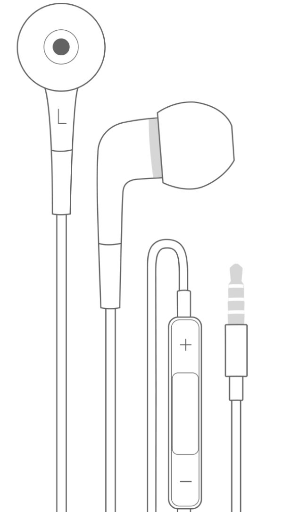
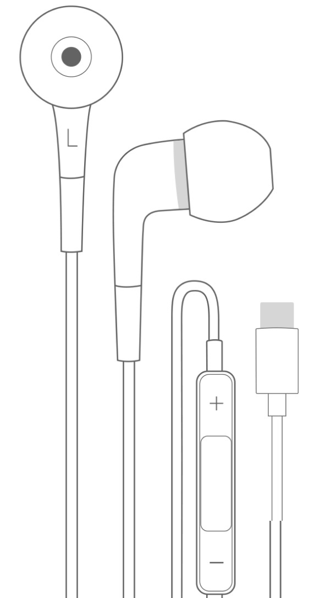
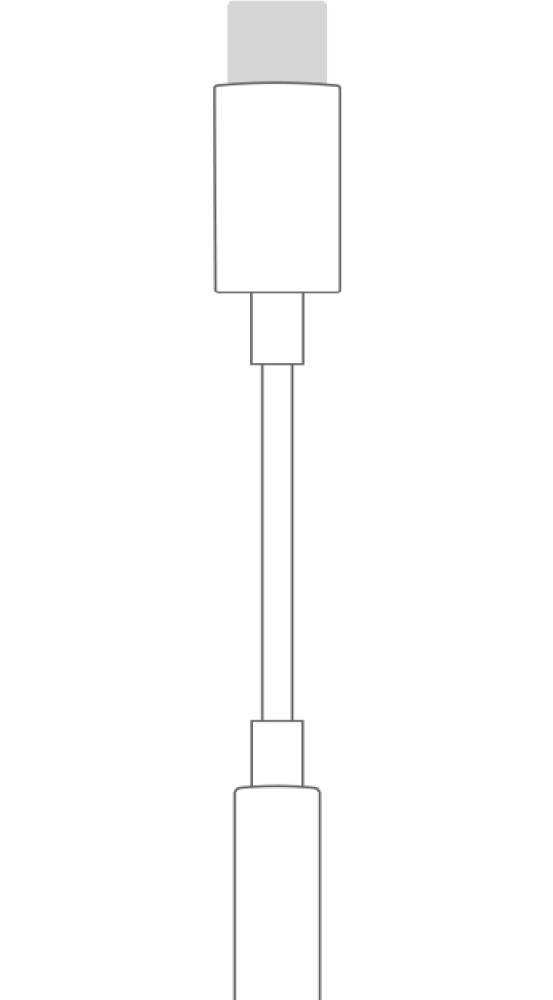
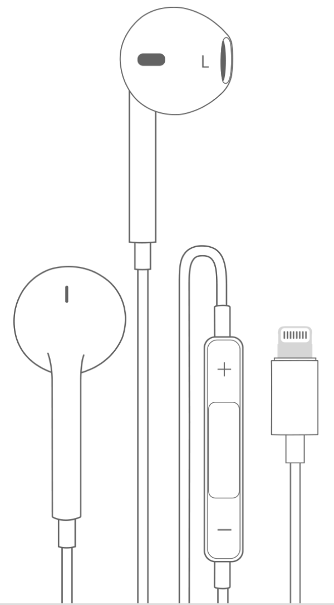
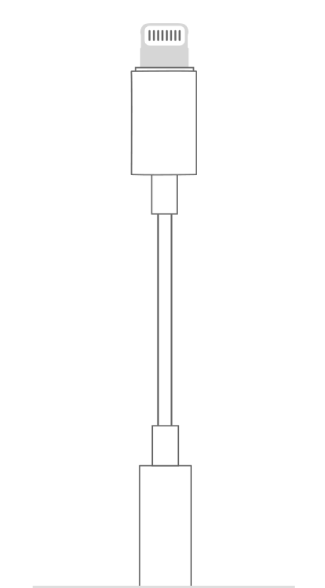

# Headphones
The way you connect wired headphones to your smartphone, tablet, or desktop depends on the available connectors:

Below are the most common connectors and the recommended ways to connect headphones to a device with each connector.

!!! note

    We strongly advise **against** using Bluetooth or any other wireless headphones for music collaboration. Bluetooth technology introduce itself anything between 100 ms and 800 ms of latency.

## 3.5-mm Headphone Jack
This is the most common option on desktops, tablets, and older smartphones.

-   <figure markdown="span">
      { width="300" loading=lazy}
      <figcaption>Headphones with 3.5-mm Headphone Plug <small>It’s a recommended setup for smartphones and tablets that have a have a 3.5-mm headphone jack.</small></figcaption>
    </figure>

## USB Type-C
USB Type-C is used in most of the modern Android phones, iPhones 15 and newer, and iPads.

-   <figure markdown="span">
      { width="300" loading=lazy}
      <figcaption>Headphones with USB-C Connector <small>Recommended for smartphones and tablets with a USB Type-C port.</small></figcaption>
    </figure>

-   <figure markdown="span">
      { width="300" loading=lazy}
      <figcaption>Headphones with USB-C Connector <small>Allows you to connect 3.5-mm headphones to a USB-C port.</small></figcaption>
    </figure>

## Apple Lightning
Apple Lightning is used in most modern iPhones 14 and older, and older iPads.

-   <figure markdown="span">
      { width="300" loading=lazy}
      <figcaption>Apple EarPods with Lightning Connector <small>Recommended for iPhones and iPads with a Lightning port.</small></figcaption>
    </figure>

-   <figure markdown="span">
      { width="300" loading=lazy}
      <figcaption>Lightning to 3.5-mm Headphone Jack Adapter <small>Allows you to connect 3.5-mm headphones to an iPhone or iPad with a Lightning port.</small></figcaption>
    </figure>

## Acknowledgements
Graphics by Apple Inc. Click [here](https://support.apple.com/en-gb/HT201869) to learn more about possible audio setups on Apple devices.
