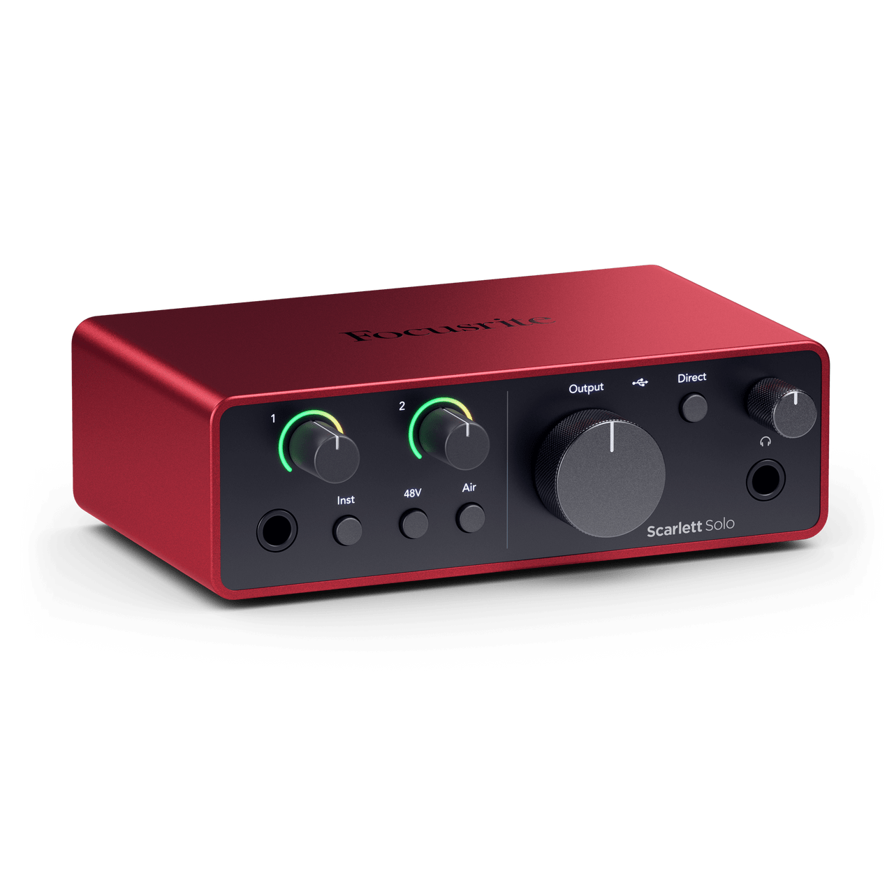
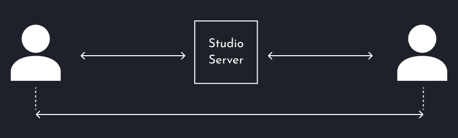

# Music Collaboration
Due to its incomparable speed, SyncStage can support music collaboration use cases starting from music education, song writing sessions, to jamming (when certain conditions are met).

Here are a few things you need to make your remote music collab successful. 

## Audio Setup

-   __Use SyncStage With Just Headphones__

    ---
    <figure markdown="span">
      { width="300" loading=lazy}
      <figcaption><small>Picture by Harman International Industries</small></figcaption>
    </figure>

    [:octicons-arrow-right-24: Learn more](headphones.md){target=_blank}

-   __Use SyncStage With An Audio Interface__

    ---
    <figure markdown="span">
      { width="300" loading=lazy}
      <figcaption><small>Picture by Focusrite Audio Engineering Limited</small></figcaption>
    </figure>

    [:octicons-arrow-right-24: Learn more](audio-interfaces.md){target=_blank}

## Network Latency
Fast and stable network is a critical for achieving real-time experience. The faster and more stable connection you have, the better experience is. 

Below you can find a mapping of network parameters into expected experience for **music jamming use case** which is the most demanding one. 

| Expected Experience | Latency | Jitter | Packet Loss |
| :-----------------: | :-----: | :----: | :---------: |
| <big>:partying_face:</big> | <= 15 ms | <= 2.0 ms | <= 0.010% |
| <big>:smiley:</big> | 16ms to 25ms | 2.1ms to 5.0ms | 0.011% to 0.02% |
| <big>:neutral_face:</big> |  25ms to 35ms | 5.1ms to 8.0ms | 0.021% to 0.03% |
| <big>:confused_face:</big> |  > 35ms | > 8.0ms | > 0.03% |

!!! note
    
    The final experience may vary different use cases. Use cases around voice communications are much less demanding.

## Distance Between The Musicians
As the distance between users increases, so does the network latency, which can potentially impede certain types of music collaboration. SyncStage uses a client-server architecture, whereby all connections are routed through its servers known as the Studio Servers. Consequently, the geographical distance between users and the Studio Server must be considered.

<figure markdown="span">
    { width="600" loading=lazy}
    <figcaption>Network latency increases with the distance</figcaption>
</figure>

| Distance In Kilometers | Distance In Miles | Network Latency Floor |
| :---------------------: | :----------------: | :--------------: |
| 200 km | ~124 mi | > 2 ms |
| 500 km | ~311 mi | > 5 ms |
| 1000 km | ~621 mi | > 10 ms |
| 2000 km | ~1243 mi | > 20 ms |
| 5000 km | ~3107 mi | > 50 ms |
| 10000 km | ~6214 mi | > 100 ms |

!!! note

    Network latency floor  only considers the propagation delay due to the speed of light in the fiber and does not account for other factors that can contribute to latency. In reality this value can be 2-5x higher.

## Latency Optimization Level
Each use case has its own latency and quality requirements. For voice communications, voice clarity is the key, whereas sub-100ms latency isn't required. For real-time music collaboration, there is nothing more important than low and stable latency. To address the needs of multiple use cases SyncStage offers `Latency Optimization Level` parameter that allows for setting up trade-off between latency level and network fluctuations resiliency. The table below shows available modes.

| Level name                           | Description                     
| ------------------------------------ | :--------------------------------------------------------------------------------------------------------- |
| High Quality                         |  SyncStage tries to maintain the highest possible quality regardless of the network fluctuations.          |
| Optimized                            |  Similar to High Quality but a bit more focused on reducing latency.                                       |
| Best Performance                     |  SyncStage is focused on delivering low latency. In poor network conditions, cracks in audio can occur.    |
| Ultra Fast                           |  SyncStage is focused on delivering possibly low and stable latency. Good network conditions needed.       |

## Avoid Acoustic Feedback

If you’re testing two smartphones without headphones connected in close proximity, you will need to be aware of audio feedback. While the SyncStage platform provides feedback cancellation, isolating the phones from each other by distance will ensure the best experience.