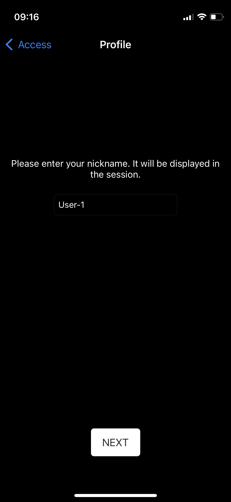
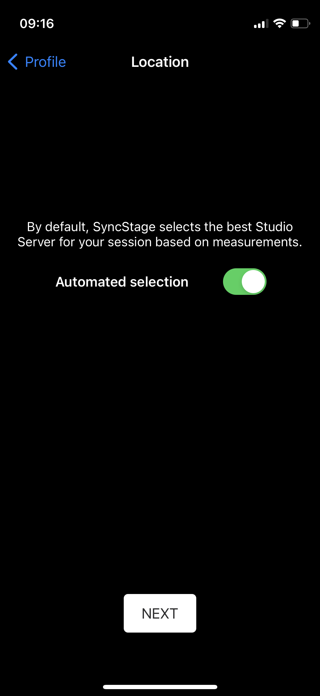
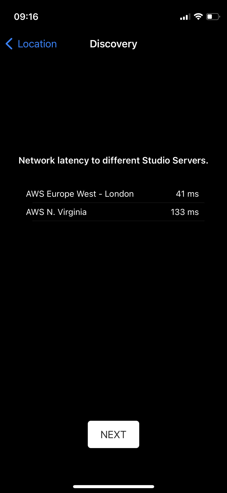
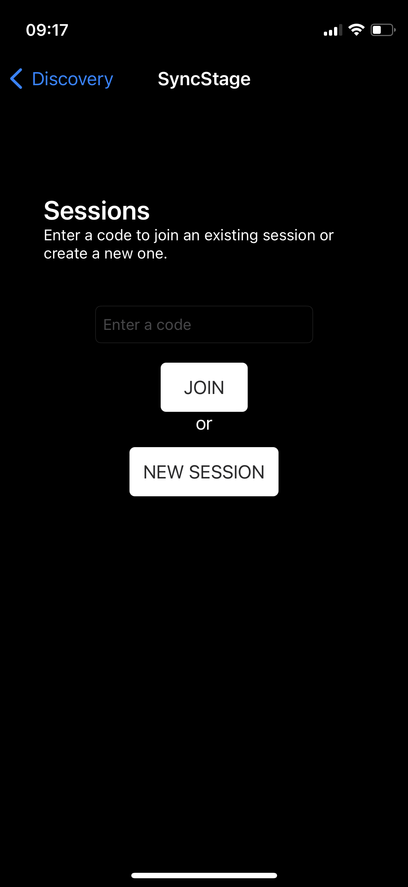
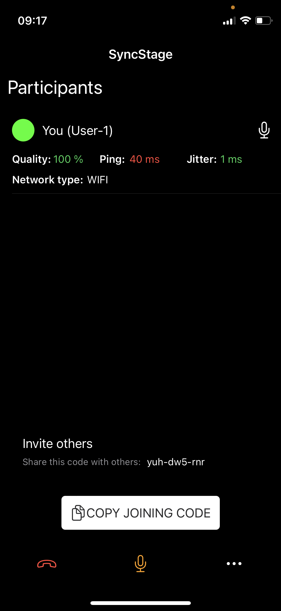
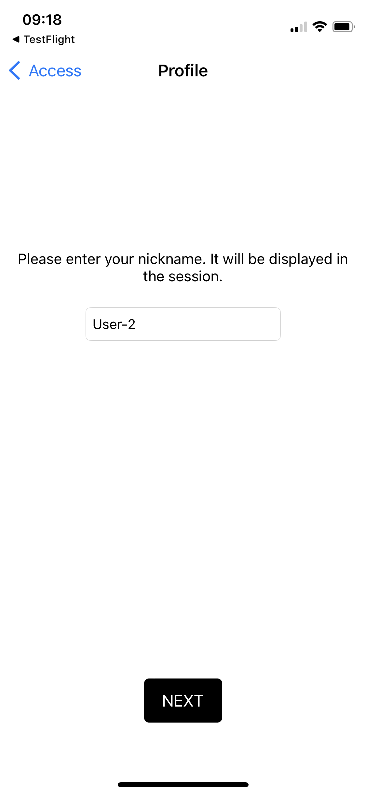
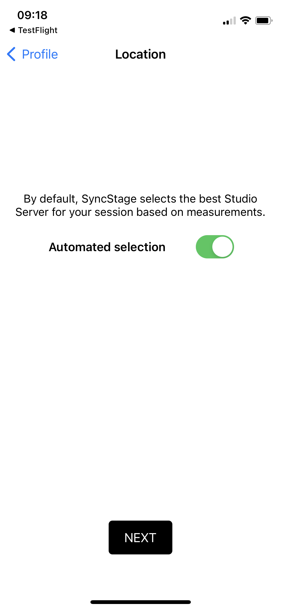
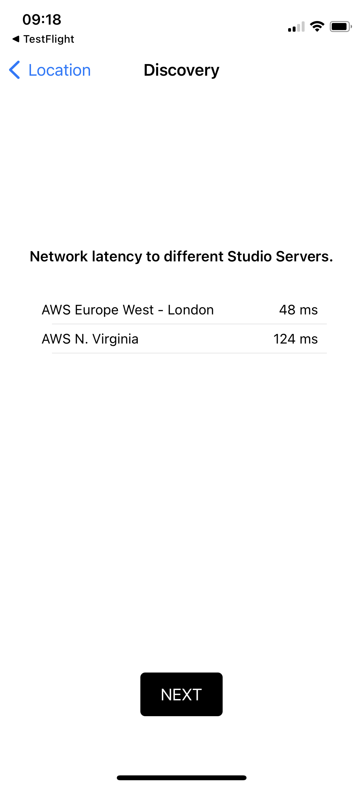
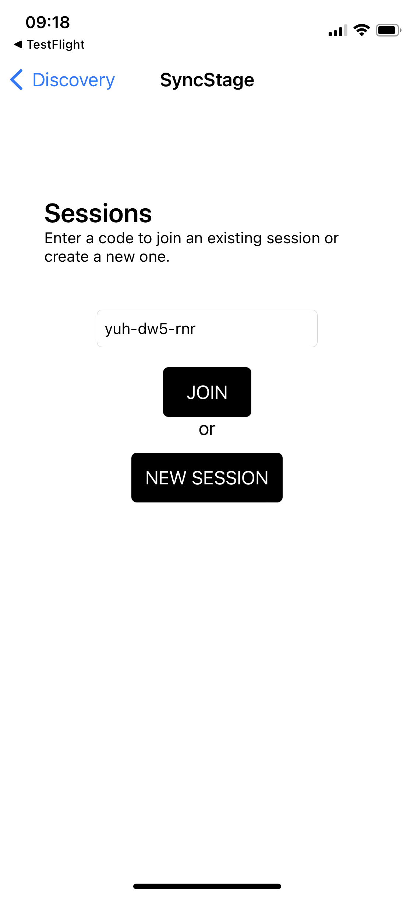
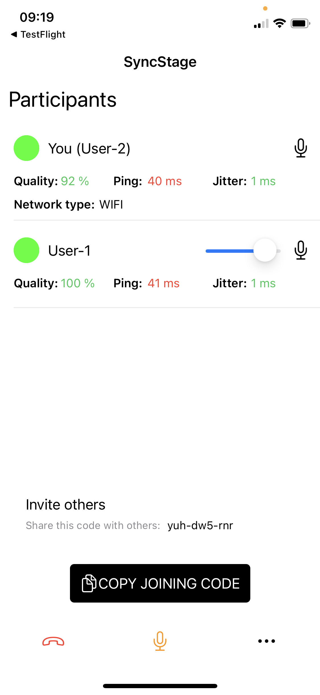

# Test App

The best way to start your journey with SyncStage is by trying out our example project available on GitHub [SyncStage Test App for iOS](https://github.com/opensesamemedia/syncstage-test-app-ios){target=_blank}.
This tutorial shows you how to clone, build, and run the application on your device.

## Set up your development project

Follow these steps to create the Test App project in Xcode.

1. Download and install [Xcode](https://developer.apple.com/xcode/){target=_blank}.
2. Clone or download the [SyncStage Test App for iOS](https://github.com/opensesamemedia/syncstage-test-app-ios){target=_blank} repository from GitHub.
3. Open (double-click) the project's project.xcworkspace file to open it in Xcode. You must use the .xcworkspace file to open the project.
 

## Get a SyncStage SDK secret
To run the SyncStage Test App you need to add a SyncStageSecret.plist to your Xcode project. Make sure that it is added to the “Copy Bundle Resources” in the target build phases.

**Don't know how to get the secret file?** See the [Quickstart Guide](quickstart.md) for more details.

## Build and run the app
To build and run the app:

1. Connect an iOS device to your computer, or select a simulator from the Xcode scheme pop-up menu.
2. In Xcode, click the Product/Run menu option (or :fontawesome-solid-play: button).
3, Xcode builds the app, and then runs the app on the device or on the simulator.

## Use the app

### Create a session  
1. Provide a nickname, e.g. *User-1*.
2. Let SyncStage find the best Studio Server location.
3. Click on the New Session button.
4. Share the session code and wait for others to join you.

| Provide nickname  | Automated server discovery | Discovery results |
:-------------------------:|:-------------------------:|:-------------------------:
{ width="300" }  |  { width="300" } |  { width="300" }

| Create a session | Invite others |
:-------------------------:|:-------------------------:
{ width="300" }  | { width="300" } 

### Join a session
1. Provide a nickname, e.g. *User-2*.
2. Let SyncStage find the best Studio Server location.
3. Input the session code.
4. Click on the Join button.
5. Now *User-1* and *User-2* are ready to have a session together!

!!! note
    Currently, Studio Server discovery results for users that are joining the session are ignored - they join the session in the same location as the session creator. This is going to change in future releases.

| Provide nickname  | Automated server discovery | Discovery results |
:-------------------------:|:-------------------------:|:-------------------------:
{ width="300" }  |  { width="300" } |  { width="300" }

| Join a session | Invite others |
:-------------------------:|:-------------------------:
{ width="300" }  | { width="300" } 

Currently, SyncStage’s audio pipeline supports sessions with **up to 8 users. **

### Other functionalities

You can control volume levels of all participants on your end, each app user can mix volumes according to their needs. Anytime you can mute / unmute yourself or simply leave the session.
