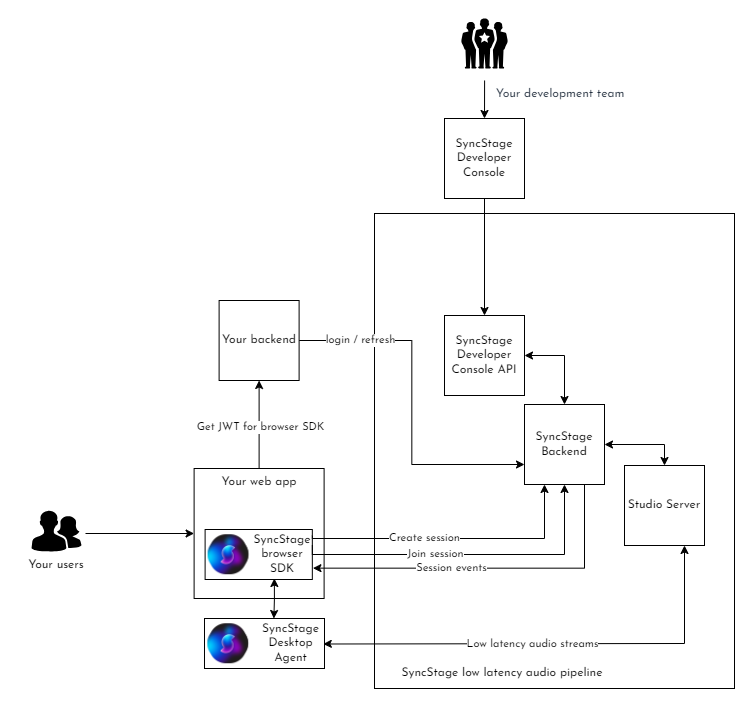

SyncStage Secret is a MASTER key used for provisioning applications defined in the Developer Console. The SyncStage Secret should be stored securely and should not be disclosed to end-users. Using the API defined below, your backend can issue time-limited tokens (jwt) that should be provided in the Web SDK's SyncStage.init(jwt: string) method.

The following API is sensitive to Cross-Origin Resource Sharing (CORS) and does not allow requests from webpages hosted on domains different from the current webpage. This restriction is in place to prevent direct usage of SyncStage secrets from web applications. The API can be freely requested from any backend service.

This API provides two methods: one for logging in using the SyncStage secret payload and the second for refreshing the jwt using a refreshToken.

<swagger-ui src="./swagger.json"/>
