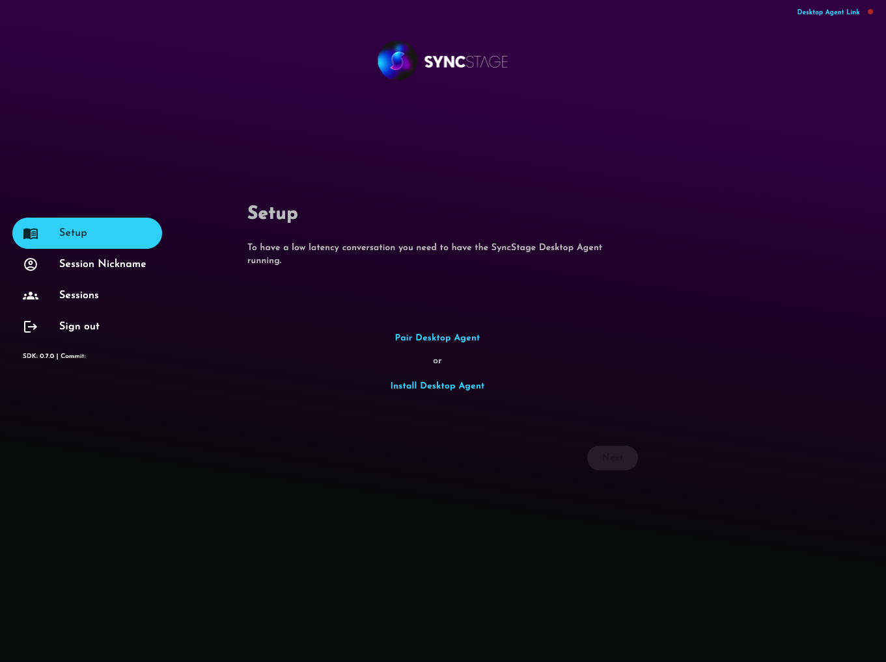
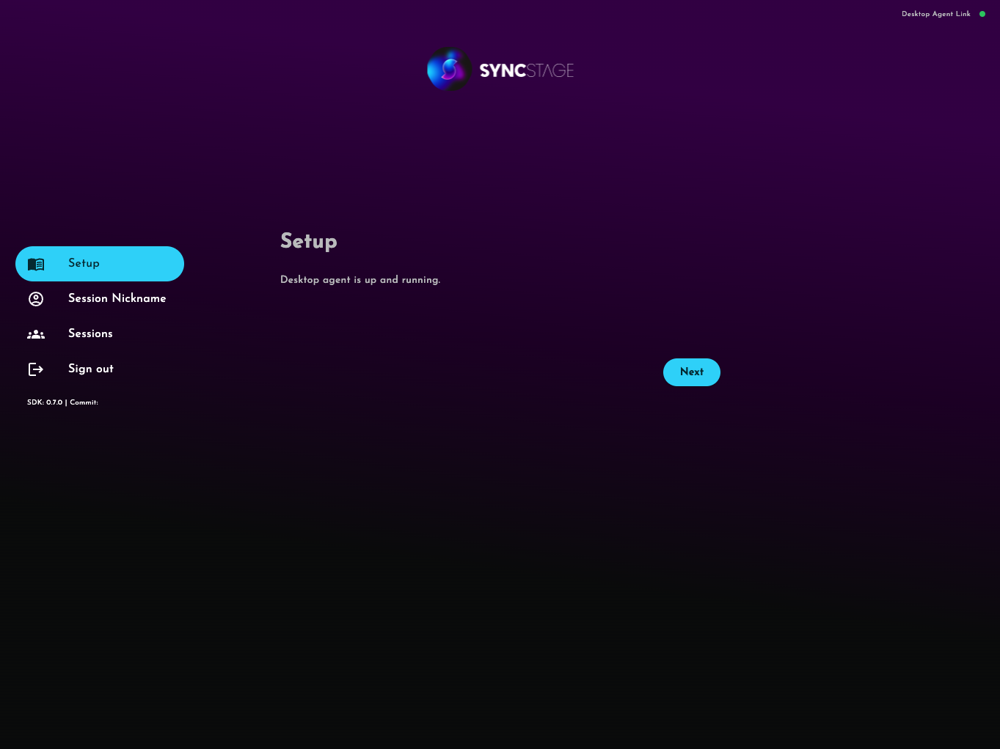

???+ warning

    SyncStage Web SDK is currently available only in PREVIEW-ONLY mode, which means it is not yet recommended for production usage. [Learn more.](../known-issues/#possible-secrets-leak){ target=_blank}.

# Test App

The best way to start you joyrney with SyncStage is by trying out our example project available on GitHub [SyncStage Test App for Web](https://github.com/opensesamemedia/syncstage-sdk-npm-package-tester){target=_blank}.
This tutorial shows you how to clone, build, and run the application on your device.

!!! tip

    [Click here](https://syncstage.web.app/){target=_blank} to use our hosted SyncStage Test App without writing a line of code.


## Get SyncStage Desktop Agent

To use test application you need to install SyncStage Desktop Agent on your Mac.

[Download SyncStage Desktop Agent for macOS](https://public.sync-stage.com/agent/macos/prod/0.1.0/SyncStageAgent_0.1.0.dmg){ .md-button}

## Get a SyncStage SDK secret
To run the SyncStage Test App you will need to add a SyncStageSecret to `.env.` file in your project.

**Don't know how to get the secret file?** See our [Quickstart Guide](quickstart.md) for more details.


## Set up your development project
Follow these steps to create the Test App project.

1. Clone or download the [SyncStage Test App for Web](https://github.com/opensesamemedia/syncstage-sdk-npm-package-tester){target=_blank} repository from GitHub.
2. Enter the project directory.
3. Create `.env` file with SyncStageSecrets inside the project directory.
    ```bash
    REACT_APP_SYNCSTAGE_SECRET_ID=
    REACT_APP_SYNCSTAGE_SECRET_KEY=
    ```
4. Start the Test App using the command below:
   ```bash
    yarn start
   ```

## Use the app

Firstly you will be asked to install Desktop Agent on your Mac.


Once installed and running you will see


Input nickname of the user that will join the session


Provide your application secret keys if they are not builded into the app.


You can choose if you want SyncStage to determine the best Studio server for you, or you want to select it manually


You can now join existing session or create a new one


Enjoy your low latency session
