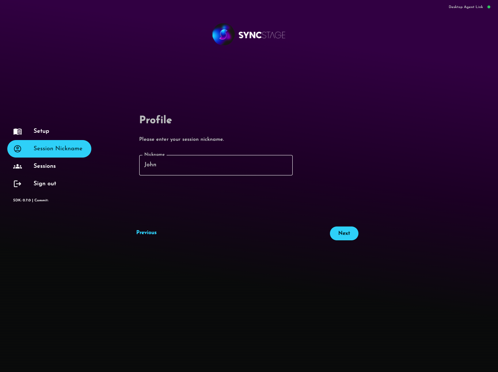

# Test App

The best way to start you journey with SyncStage is by trying out our example project available on GitHub [SyncStage Test App for Web](https://github.com/opensesamemedia/syncstage-sdk-npm-package-tester){target=_blank}.
This tutorial shows you how to clone, build, and run the application on your device or on AWS Amplify.


## Get SyncStage Desktop Agent

To use test application you need to install SyncStage Desktop Agent on your Mac.

[:fontawesome-brands-apple: Download for macOS]({{ latest_desktop_agent_for_macos_url }}){ .md-button}
[:fontawesome-brands-windows: Download for Windows]({{ latest_desktop_agent_for_windows_url }}){ .md-button}

## Get a SyncStage SDK secret

To run the SyncStage Test App you will need to add a SyncStageSecret to the backend (as a file using docker-compose deployment or as a secret in Amplify deployment).

**Don't know how to get the secret file?** See our [Quickstart Guide](quickstart.md) for more details.


## Set up your development project
Follow these steps to run the Test App project on your local machine.

1. Clone a repository using: `git clone git@github.com:opensesamemedia/syncstage-sdk-npm-package-tester.git`
2. Create `.env` file within `web-application` directory and fill it with following variables:
```
REACT_APP_DOCKER_COMPOSE_BACKEND=true
REACT_APP_BACKEND_BASE_PATH=http://localhost:3000/api
```
3. Ensure Docker and docker-compose are installed on your machine.
4. Copy the SyncStageSecret.json file into the `backend/src` path.
5. Open a terminal and navigate to the root directory of the repository.
6. Run the following commands:
```
docker-compose build --no-cache
docker-compose up
```
7. The application will start and you can access it in your browser at `http://localhost:3001` (it might take some time to load, because it runs in development mode)

## Use the app

Firstly you will be asked to login. Credentials are defined in `backend/src/user-db.json` file for docker-compose deployment or in the AWS Cognito using AWS Amplify deployment [(learn more)](https://github.com/opensesamemedia/syncstage-sdk-npm-package-tester){target=_blank}.


Then you will be asked to install Desktop Agent on your Mac.


Once installed and running you will see


Input nickname of the user that will join the session


You can now join existing session or create a new one


Enjoy your low latency session

